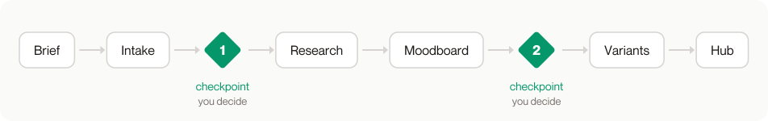
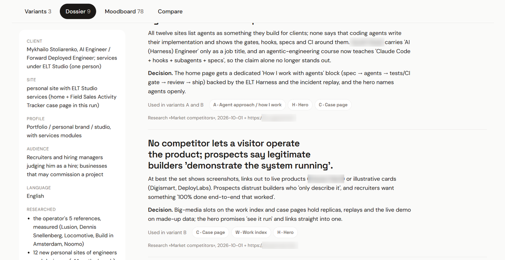
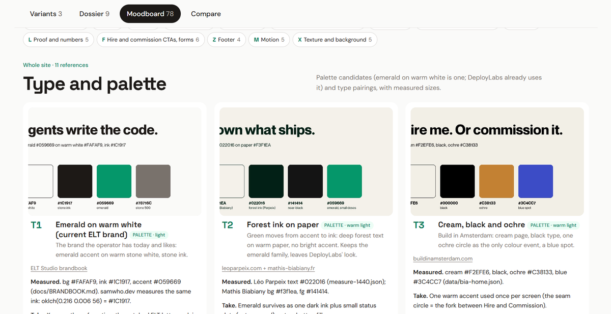
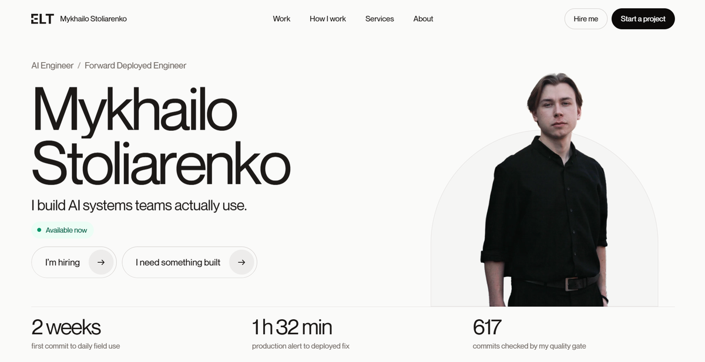
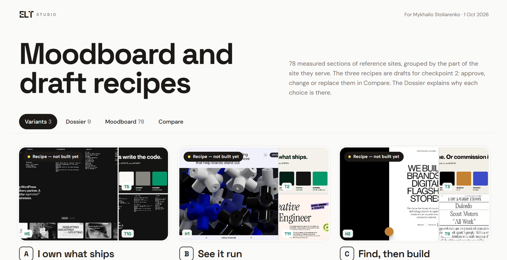

<p align="center">
  <picture>
    <source media="(prefers-color-scheme: dark)" srcset="docs/assets/wordmark-dark.svg">
    
  </picture>
</p>

<h3 align="center">Client brief in the morning, clickable website prototypes by evening.</h3>

<p align="center">
  A Claude Code plugin · <a href="#install">Install</a> · <a href="https://stoliarenko-site-proto.vercel.app/">Hub from a real run</a>
</p>

<p align="center">
  <picture>
    <source media="(prefers-color-scheme: dark)" srcset="docs/assets/pipeline-dark.svg">
    
  </picture>
</p>

| 2 h 31 min | 78 | 2 |
|:-:|:-:|:-:|
| from intake to three deployed variants and a hub | measured reference sections on one moodboard | checkpoints where a person decides |

<p align="center"><sub>From two runs: a sign company in Los Angeles on 24 Sep 2026, and my own portfolio site on 1 Oct 2026. Each run log records when every phase started and ended.</sub></p>

## Install

```text
/plugin marketplace add prodelt/elt-design
/plugin install elt-design@prodelt
```

Open Claude Code in the client's folder and run `/elt-design:elt-design`. It starts a run or continues the open one. Add `status` to see where the run is, or `polish` for one round of changes after the client has seen the hub. Everything the plugin writes goes into `elt-design/` in that folder, and the client's own files stay untouched.

<details>
<summary>Link the skill folder instead (development)</summary>

```powershell
# Windows (PowerShell)
New-Item -ItemType Junction -Path "$HOME\.claude\skills\elt-design" -Target "<clone>\skills\elt-design"
```

```sh
# macOS, Linux
ln -s "<clone>/skills/elt-design" ~/.claude/skills/elt-design
```

A linked skill answers to `/elt-design`.

</details>

## What you get

<table>
<tr>
<td width="50%"><br>A research dossier: what competitors show and what they skip, with a decision for each finding.</td>
<td width="50%"><br>A moodboard of real sections from reference sites, with measured colours, type and sizes.</td>
</tr>
<tr>
<td><br>Three to five site variants, each built from the code of its references.</td>
<td><br>A hub page that presents the variants, the dossier and the moodboard to the client.</td>
</tr>
</table>

Frames from the run for my own portfolio site on 1 October 2026. A second mode, Creative Set, makes stories, posts and carousels on a Figma canvas that both Claude and a person can edit.

<details>
<summary>How a run goes</summary>

0. Start: `sp env` checks Node and Chrome, and the run gets its folder.
1. Intake: the brief, the client's rules and files. At checkpoint 1 the operator confirms the brief.
2. Research: agents study competitors and reference sites in parallel.
3. Moodboard: cards with measurements and a draft recipe for each variant. At checkpoint 2 the operator approves, changes or replaces the recipes.
4. Variants: one agent per recipe builds a site.
5. Review, then 6. the hub the client sees.
7. Retro: the run log with the time each phase took.

The toolkit keeps the next phase closed until the checkpoint file holds the operator's own words, and it copies those words into every later agent's assignment.

</details>

## Status

v1 is in progress. Runs, checkpoints and agent assignments work; most phase instructions are still being written, so the runs so far were driven by hand along the same phases.

## Requirements

Claude Code, Node.js 20 or newer, Google Chrome, and the `grilling` skill from [mattpocock/skills](https://github.com/mattpocock/skills).

## Development

`sp` is the Node toolkit the skill drives: `node skills/elt-design/toolkit/sp.mjs --help` lists its commands. Tests: `npm test` in `skills/elt-design/toolkit/`.

## License

MIT
